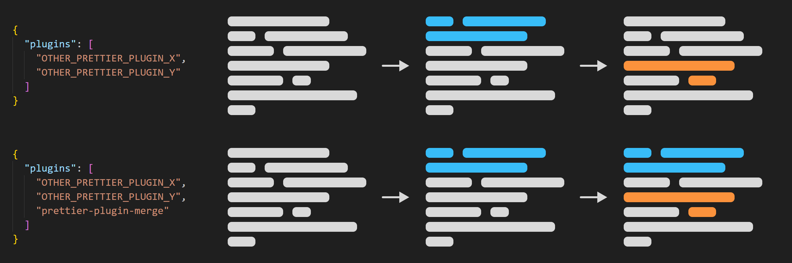

# prettier-plugin-merge

A Prettier plugin that sequentially merges the formatting results of other Prettier plugins.



## Why prettier-plugin-merge?

Prettier has its limitations. If two or more plugins are configured to format a particular language, Prettier will only use the last of those plugins.

So, for example, if you configure it like this for JavaScript formatting, only `prettier-plugin-classnames` will be used.

<!-- prettier-ignore -->
```jsonc
{
  "plugins": [
    "prettier-plugin-tailwindcss",
    "prettier-plugin-classnames" // Prettier only uses this
  ]
}
```

However, you can overcome this limitation by adding `prettier-plugin-merge` as the last plugin.

<!-- prettier-ignore -->
```diff
 {
   "plugins": [
     "prettier-plugin-tailwindcss",
-    "prettier-plugin-classnames"
+    "prettier-plugin-classnames",
+    "prettier-plugin-merge"
   ]
 }
```

As mentioned above, Prettier uses the last of the plugins that can format a particular language (in this case JavaScript), so `prettier-plugin-merge` is used in the changed configuration.

<!-- prettier-ignore -->
```jsonc
{
  "plugins": [
    "prettier-plugin-tailwindcss",
    "prettier-plugin-classnames",
    "prettier-plugin-merge" // Prettier only uses this
  ]
}
```

`prettier-plugin-merge` uses plugins written before this one in order, merging as much as possible the differences in formatting results depending on the presence of the plugin.

So you can combine as many plugins as you want.

## Installation

For Prettier v2:

```sh
npm install -D prettier@^2 prettier-plugin-merge
```

For Prettier v3:

```sh
npm install -D prettier prettier-plugin-merge
```

## Configuration

**Note**: This plugin MUST come last. Other plugins usually have no order constraints. However, if there are multiple plugins formatting the same area, the output may vary depending on the order of those plugins.

JSON example:

<!-- prettier-ignore -->
```json
{
  "plugins": [
    "prettier-plugin-tailwindcss",
    "prettier-plugin-classnames",
    "prettier-plugin-merge"
  ]
}
```

JS example (CommonJS module):

```javascript
module.exports = {
  plugins: [
    '@trivago/prettier-plugin-sort-imports',
    'prettier-plugin-brace-style',
    'prettier-plugin-merge',
  ],
  braceStyle: 'stroustrup',
};
```

JS example (ES module):

```javascript
export default {
  plugins: [
    'prettier-plugin-brace-style',
    '@trivago/prettier-plugin-sort-imports',
    'prettier-plugin-merge',
  ],
  importOrder: ['<THIRD_PARTY_MODULES>', '^@[^/]+/(.*)$', '^@/(.*)$', '^[./]'],
  importOrderSeparation: true,
};
```

## Version correlation with sibling plugins

Starting with `0.6.0`, when there is a minor release on one side, I plan to reflect that change on the other side as well if possible.


## Compatibility with other Prettier plugins

All other plugins used with this plugin must be compatible with your version of Prettier.

For example, suppose you have three plugins:

- `prettier-plugin-A`: Only compatible with Prettier v2
- `prettier-plugin-B`: Only compatible with Prettier v3
- `prettier-plugin-X`: Compatible with both versions

Prettier v2 users can only configure `prettier-plugin-A` and `prettier-plugin-X`, and Prettier v3 users can only configure `prettier-plugin-B` and `prettier-plugin-X`.
